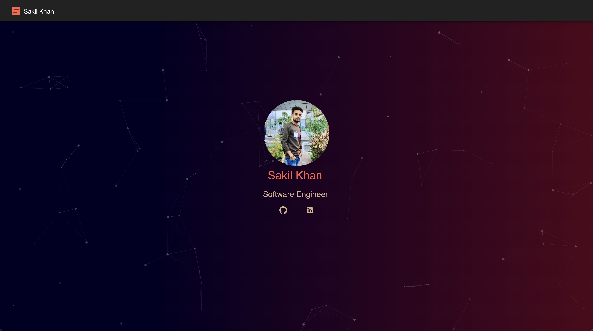
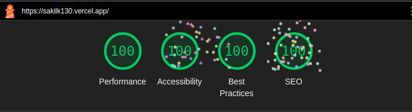

<h1 align="center">🌟 React Portfolio Website 🌟</h1>

<p align="center">
  
</p>

<p align="center">
  
</p>

<p align="center">
  A highly customizable React-based portfolio template to showcase your skills, projects, and experience. This template features a modern, clean design, responsive layout, and easy-to-edit content, enabling you to highlight your work effectively.  
  <br><br>
  🌐 **Live Preview:** [Check out my portfolio](https://sakilk130.vercel.app/)
</p>

---

## 🚀 Features

- **Modern & Clean Design:** Professional and sleek design to make your portfolio stand out.
- **Responsive Layout:** Optimized for seamless viewing on any device, from desktop to mobile.
- **Simple Customization:** Tailor the template by easily changing content, colors, fonts, and sections to match your personal brand.
- **Project, Skills & Experience Sections:** Highlight your key projects, technical skills, and career journey in structured, easy-to-read sections.
- **Contact Form Integration:** Let potential collaborators and employers easily connect with you.

---

## 🛠️ Getting Started

Follow the instructions below to set up and customize your own portfolio.

### Prerequisites

Make sure you have the following installed on your local machine:

- **[Node.js](https://nodejs.org)** (v14+ recommended)

### Installation

1. **Clone the repository:**

   ```bash
   git clone https://github.com/sakilk130/react-portfolio-website.git
   ```

2. Navigate into the project directory:

   ```bash
   cd react-portfolio-website
   ```

3. Install the required dependencies:

   ```bash
   npm install
   ```

---

## 🎨 Customization

### 1. Update Content

To personalize the portfolio with your information:

- Open `src/data/data.js` and replace the placeholder content with your details (projects, skills, experiences, etc.).
- Replace the images in the `public/images` folder with your own project screenshots or a personal profile photo.

### 2. Modify Appearance

- **Fonts:** Modify fonts by editing the links in `public/index.html` to include your preferred Google Fonts or other font services.
- **Sections:** You can add, remove, or edit sections by modifying components in the `src/components` folder to fit your portfolio's structure.

---

## 🚧 Development

To preview and edit the website locally:

1. Start the development server:

   ```bash
   npm start
   ```

2. Open your browser and visit **[http://localhost:3000](http://localhost:3000)** to view the site.

---

## 🚢 Deployment

You can deploy your portfolio using any of the following services:

- **Vercel:** Instant deploy via [Vercel](https://vercel.com/).
- **Netlify:** Simple CI/CD deployment via [Netlify](https://www.netlify.com/).
- **GitHub Pages:** Follow the instructions in the [Create React App documentation](https://create-react-app.dev/docs/deployment) for GitHub Pages.

---

## 🤝 Contributing

Contributions are welcome! If you encounter any issues or have ideas for improvements, feel free to [open an issue](https://github.com/sakilk130/react-portfolio-website/issues) or submit a pull request. Your feedback is greatly appreciated.

---

## 📄 License

This project is licensed under the MIT License. Feel free to use and modify it for your own projects.

---

Happy coding! 😊
